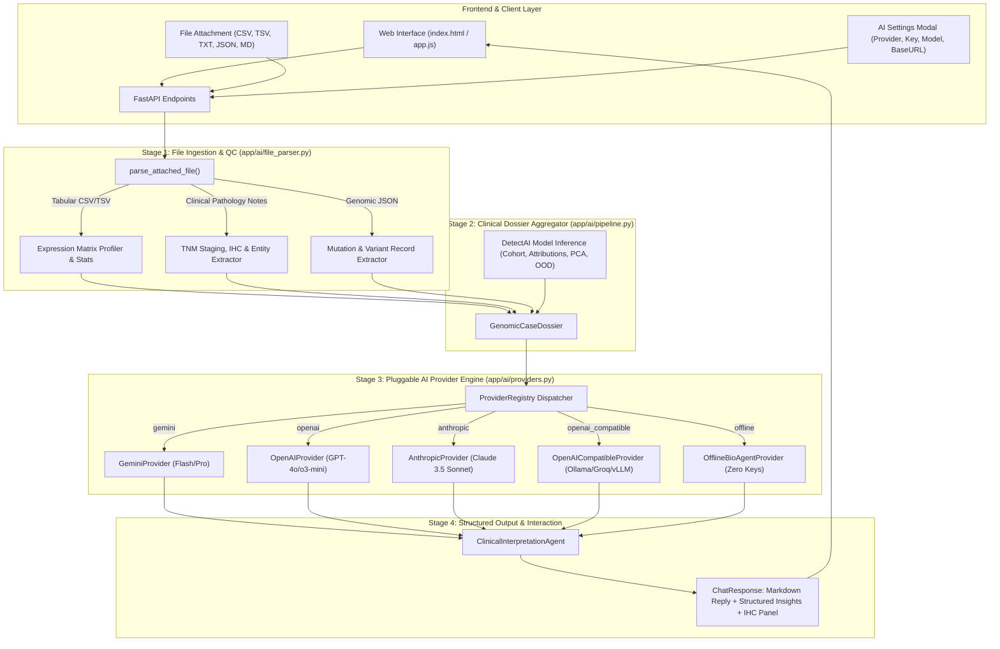

# DetectAI: Open-Source Pluggable AI Provider Architecture & Clinical Interpretation Pipeline

Welcome to DetectAI's extensible AI agent architecture. This document provides complete architectural specifications, workflow diagrams, environment configuration guides, and a step-by-step developer tutorial for extending DetectAI with custom Large Language Models (LLMs) and local inference engines.

---

## 1. Architectural Overview & Workflow

DetectAI decouples clinical inference from specific proprietary AI vendors by employing a clean **Strategy & Adapter Pattern** with zero heavy SDK dependencies (using lightweight HTTP requests via `requests` / `httpx`).



---

## 2. Pluggable AI Providers

DetectAI supports 5 out-of-the-box provider implementations:

| Provider ID | Provider Class | Default Model | Key Env Var | Description |
| :--- | :--- | :--- | :--- | :--- |
| `offline` | `OfflineBioAgentProvider` | `detectai-expert-rules-v1` | *None (Zero Keys)* | Built-in clinical oncologist rules, cohort pathways, and IHC panels. 100% offline. |
| `gemini` | `GeminiProvider` | `gemini-1.5-flash` | `GEMINI_API_KEY` | Google Generative AI REST API with structured system instructions. |
| `openai` | `OpenAIProvider` | `gpt-4o-mini` | `OPENAI_API_KEY` | OpenAI Chat Completions API supporting GPT-4o, GPT-4o-mini, o3-mini. |
| `anthropic` | `AnthropicProvider` | `claude-3-5-sonnet-20241022` | `ANTHROPIC_API_KEY` | Anthropic Messages API with strict role alternation and system prompts. |
| `openai_compatible` | `OpenAICompatibleProvider` | `llama3.2` | `OPENAI_COMPATIBLE_API_KEY` | Standard `/v1/chat/completions` protocol for Ollama, Groq, vLLM, LMStudio. |

### Provider Resolution Priority:
1. **Per-Request Configuration:** Sent via `provider_config` in `POST /chat` (configured via UI ⚙️ AI Settings modal). When set to `auto` (the default), resolution automatically cascades to server environment variables and active defaults.
2. **Environment Variable `AI_PROVIDER`:** `offline`, `gemini`, `openai`, `anthropic`, or `openai_compatible`.
3. **Automatic Key Detection:** If `GEMINI_API_KEY`, `OPENAI_API_KEY`, or `ANTHROPIC_API_KEY` is present in the server environment.
4. **Graceful Fallback:** If an external provider lacks an API key or encounters network/rate-limit errors, the system automatically falls back to `OfflineBioAgentProvider` with an alert disclaimer.

---

## 3. Attached File Interpretation Pipeline

The file interpretation pipeline (`app/ai/file_parser.py`) extracts critical diagnostic evidence from uploaded documents up to **5 MB**:

### Supported File Types:
1. **Tabular Gene Expression (`.csv`, `.tsv`)**:
   - Universal orientation sniffing for both wide (genes in header columns) and tall/panel (genes in first column rows, single gene key-values, and headerless tables).
   - Comma, tab, and semicolon delimiter support.
   - Statistical profiling: mean expression, standard deviation, dynamic range `[min, max]`, zero fraction percentage.
   - Top 5 highest and lowest expressed genes.
   - Matching against DetectAI's 2,000 feature space and raw 20,531 vector extraction.
2. **Clinical & Pathology Notes (`.txt`, `.md`)**:
   - **TNM Staging:** Regex detection of primary tumor, lymph node, and distant metastasis, supporting pathological (`pT2aN0M0`), clinical (`cT1N0M0`), in-situ (`TisN0M0`), and undetermined (`Tx/Nx/Mx`) stages.
   - **Histology Extraction:** Invasive ductal carcinoma, clear cell renal carcinoma, colon adenocarcinoma, lung adenocarcinoma, prostate adenocarcinoma, etc.
   - **Immunohistochemistry (IHC) Markers:** ER, PR, HER2, Ki-67, CD10, Pax-8, CA9, CDX2, CK20, CK7, MLH1, MSH2, MSH6, PMS2, TTF-1, Napsin-A, PSA, PSMA, AMACR (with full support for standard hyphenated notations like `ER-positive` and `HER2-negative`).
   - **Demographics & History:** Age (e.g. `62yo`, `Age: 58`), sex, prior surgical resections (mastectomy, nephrectomy, etc.), adjuvant therapies.
3. **Genomic Variant & Clinical Records (`.json`)**:
   - Parses top-level and nested gene expression dictionaries or vectors (`{"sample_id": "...", "gene_values": [...]}`).
   - Computes full statistical profiles and extracts model-aligned feature vectors.
   - Extracts somatic variant and mutation lists (e.g. `TP53`, `KRAS G12D`, `EGFR L858R`).
   - Parses structured clinical record fields.

---

## 4. Contributor Tutorial: Add a New AI Provider in 3 Steps

Adding a new AI provider (e.g., DeepSeek, Mistral, Cohere, or an internal clinical LLM) takes under 30 lines of code.

### Step 1: Subclass `BaseAIProvider`
Create your provider in `app/ai/providers.py` or an external module:

```python
import os
import requests
from typing import Any
from app.ai.providers import BaseAIProvider

class DeepSeekProvider(BaseAIProvider):
    provider_id = "deepseek"
    display_name = "DeepSeek Reasoner"
    default_model = "deepseek-chat"
    requires_api_key = True

    def _detect_env_key(self) -> str:
        return os.environ.get("DEEPSEEK_API_KEY", "")

    def _default_base_url(self) -> str:
        return "https://api.deepseek.com/v1"

    def generate_response(
        self,
        messages: list[dict[str, str]],
        system_prompt: str = "",
        **kwargs: Any,
    ) -> str:
        if not self.api_key:
            raise ValueError("DeepSeek API key is required.")

        headers = {
            "Authorization": f"Bearer {self.api_key}",
            "Content-Type": "application/json",
        }
        api_messages = []
        if system_prompt:
            api_messages.append({"role": "system", "content": system_prompt})
        for m in messages:
            role = "assistant" if m.get("role") in ("model", "assistant") else "user"
            api_messages.append({"role": role, "content": m.get("content", "")})

        body = {
            "model": self.model_name,
            "messages": api_messages,
            "temperature": kwargs.get("temperature", 0.2),
        }

        response = requests.post(
            f"{self.base_url}/chat/completions",
            headers=headers,
            json=body,
            timeout=self.timeout,
        )
        response.raise_for_status()
        return response.json()["choices"][0]["message"]["content"]
```

### Step 2: Register in `ProviderRegistry`
In `app/ai/providers.py` or during application startup:

```python
from app.ai.providers import registry

registry.register("deepseek", DeepSeekProvider)
```

Now `GET /ai/providers` will automatically include DeepSeek, and clients can specify `{"provider_name": "deepseek"}` in their chat requests.

### Step 3: Add Automated Unit Tests
Add a test in `tests/test_ai_pipeline.py` mocking the HTTP endpoint:

```python
def test_deepseek_provider(monkeypatch):
    provider = DeepSeekProvider(api_key="test-key")
    # Verify request construction and response parsing
    ...
```

---

## 5. API Reference

### `GET /ai/providers`
Returns catalog of available providers and default configuration status.

**Response:**
```json
{
  "providers": [
    {
      "id": "offline",
      "name": "Offline Clinical Bio-Agent",
      "default_model": "detectai-expert-rules-v1",
      "configured_model": "detectai-expert-rules-v1",
      "requires_key": false,
      "is_configured": true,
      "base_url": null
    },
    {
      "id": "gemini",
      "name": "Google Gemini",
      "default_model": "gemini-1.5-flash",
      "requires_key": true,
      "is_configured": false,
      "base_url": "https://generativelanguage.googleapis.com/v1beta"
    }
  ],
  "active_default": "offline"
}
```

### `POST /chat/upload`
Profiles an uploaded clinical file and returns immediate structural metrics.
Accepts `multipart/form-data` with `file` field OR `application/json` with `{ "filename": "...", "content": "..." }`.

**Response:**
```json
{
  "filename": "patient_note.txt",
  "file_type": "clinical_note",
  "file_size_bytes": 412,
  "summary_text": "Clinical Pathology Note. Histology: Invasive Ductal Carcinoma | Staging: T2N0M0 | Patient: 54 y/o Female | IHC: ER: positive, PR: positive, HER2: negative",
  "detected_entities": {
    "tnm_stage": "T2N0M0",
    "age": 54,
    "sex": "Female",
    "histology": ["Invasive Ductal Carcinoma"],
    "ihc_markers": { "ER": "positive", "PR": "positive", "HER2": "negative" }
  },
  "tabular_stats": null,
  "matched_genes": [],
  "warnings": []
}
```

### `POST /chat`
Submits query, conversation history, prediction context, attached files, and provider settings.

**Request:**
```json
{
  "message": "Interpret driving biomarkers with attached pathology note.",
  "history": [],
  "prediction": {
    "predicted_class": "BRCA",
    "confidence": 0.88,
    "class_probabilities": { "BRCA": 0.88, "LUAD": 0.08, "KIRC": 0.02, "COAD": 0.01, "PRAD": 0.01 },
    "top_features": [{ "gene": "gene_11457", "expression": 2.1, "attribution": 0.35 }],
    "suppressed_features": [{ "gene": "gene_8030", "expression": -2.4, "attribution": -0.28 }],
    "low_confidence": false
  },
  "attached_files": [
    {
      "filename": "biopsy.txt",
      "content": "54yo female, Invasive Ductal Carcinoma, Stage IIA (T2N0M0). IHC ER+ PR+ HER2-."
    }
  ],
  "provider_config": {
    "provider_name": "offline"
  }
}
```

**Response:**
```json
{
  "reply": "**Genomic Attribution Analysis for BRCA** (Confidence: 88.0%): ...",
  "provider_used": "Offline Clinical Bio-Agent",
  "file_summaries": [ ... ],
  "structured_insights": {
    "predicted_class": "BRCA",
    "confidence": 0.88,
    "confidence_status": "High Confidence",
    "top_drivers": ["gene_11457"],
    "suppressed_biomarkers": ["gene_8030"],
    "ihc_recommendations": ["ER (ESR1)", "PR (PGR)", "HER2 (ERBB2)", "GATA3", "Mammaglobin (SCGB2A2)", "Ki-67 (MKI67)"],
    "attached_file_count": 1,
    "provider_used": "Offline Clinical Bio-Agent"
  }
}
```

---

## 6. Environment Variables Reference

| Variable | Description |
| :--- | :--- |
| `AI_PROVIDER` | Override default provider (`offline`, `gemini`, `openai`, `anthropic`, `openai_compatible`). |
| `GEMINI_API_KEY` | API Key for Google Generative AI (Gemini 1.5 Flash / 2.0 Flash). |
| `OPENAI_API_KEY` | API Key for OpenAI models. |
| `OPENAI_BASE_URL` | Base URL for OpenAI API (default: `https://api.openai.com/v1`). |
| `ANTHROPIC_API_KEY` | API Key for Anthropic Claude. |
| `OPENAI_COMPATIBLE_BASE_URL` | Base URL for Ollama, Groq, vLLM (default: `http://localhost:11434/v1`). |
| `OPENAI_COMPATIBLE_API_KEY` | Optional key for commercial OpenAI-compatible proxies. |
